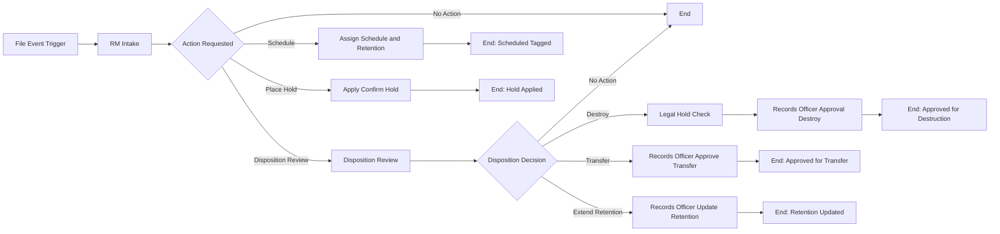

# Use Case Overview: DXR File Records Governance in Collibra

## Problem statement

DXR sends file-centric metadata into Collibra, but RM decisions still need governance workflows:

- Which files should be scheduled for retention?
- Which files must be put on legal hold?
- Which files are disposition candidates?

This workflow provides a repeatable control path with approvals and traceability.

## Business objective

Demonstrate an RM operating model where:

- Trigger: a file event (status or attribute change)
- Triage: business steward selects RM action
- Control checks: legal hold and records approvals are enforced
- Evidence: decisions are captured in tasks and reflected in file metadata

## Primary actors

- Business Steward: triage request
- Legal: hold confirmation/check
- Records Officer / Records Manager: schedule/disposition decisions and approvals

## End-to-end flow

## Scope

In scope:

- Collibra workflow and tasks
- RM metadata update on File asset
- Governance evidence and audit trail

Out of scope:

- Physical delete/transfer in storage platforms
- Fully automated classification-to-retention mapping

## Success criteria

- Workflow reliably starts from configured event
- Tasks route through expected branch
- File metadata reflects decisions
- History and task trail are auditable
